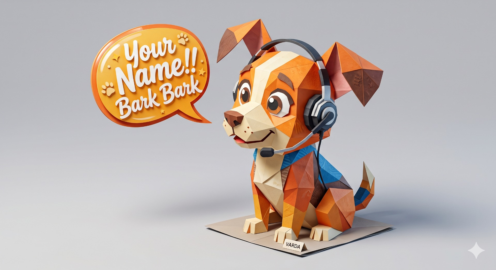

<p align="center">
  
</p>

# 🐶 AudioWatchDoge Studio v5.0

A universal, cross-platform audio intelligence studio for high-fidelity transcription, live signal monitoring, and contextual subject filtering. Rebuilt with a factorized Clean Architecture following the GodeMode "Places" pattern.

## 🚀 Overview
AudioWatchDoge transforms raw audio into actionable intelligence. It leverages **Faster-Whisper** for real-time transcription and a multi-threaded engine to identify specific subjects and phrases within a sliding 10-second contextual window.

### Key Capabilities:
- **Universal Capture**: Seamless switching between Browser-Native APIs (Web Audio / Display Media) and OS-Native High-Fidelity Proxies.
- **Contextual Highlights**: Intelligent keyword/phrase detection with automatic surrounding context retrieval.
- **Intelligence Domains**: Swappable "Subject Packs" (UX/UI, Architect, General) to tailor the engine to your current task.
- **Material Design 2**: A premium "Soft Dark" interface strictly following M2 specifications for low eye fatigue.

---

## 🛠 Project Architecture

The project is structured into modular domains for maximum maintainability:

### **📡 Backend (`backend/`)**
- **`api/server.py`**: FastAPI entry point. Orchestrates binary WebSockets and REST services.
- **`api/subject_packs.py`**: Curated intelligence dictionaries for different professional domains.
- **`engine/engine_core.py`**: The "Heart". Multi-threaded processor managing audio buffers and Whisper AI.
- **`engine/filter_logic.py`**: The "Brain". Implements fuzzy matching and contextual sliding windows.

### **🖥️ Hardware (`hardware/`)**
- **`win_audio_proxy.py`**: Windows-native Mic capture (TCP Port 9000).
- **`win_system_proxy.py`**: Windows-native Desktop audio capture (TCP Port 9001).

### **🎨 Frontend (`ui/`)**
- **The JS Place (`ui/src/hooks/`, `ui/src/api/`)**: Pure logic, state management, and API services.
- **The HTML Place (`ui/src/components/`, `ui/src/App.tsx`)**: Modular view components and layout shell.
- **The CSS Place (`ui/src/styles/StudioStyles.ts`)**: Centralized MUI styling manifest following Material Design 2.

---

## ⚡ Setup Guide

### 1. Backend (WSL2 / Linux)
Requires Python 3.12+ and FFmpeg.
```bash
# Install dependencies
pip install fastapi uvicorn faster-whisper numpy soundcard

# Run the studio server
python3 backend/api/server.py
```

### 2. Frontend (Windows / Mac / Linux)
Requires Node.js 18+.
```bash
cd ui
npm install
npm start
```

---

## 🎙 Usage Guide

### 1. Initialize Studio
Upon launch, choose an **Intelligence Domain** (e.g., UX/UI Designer). This loads specific keyword cloud into the GPU filter.

### 2. Capture Audio
- **MIC**: Instant browser-based microphone recording.
- **SYSTEM AUDIO**: Browser-based desktop capture (requires "Share system audio" check).
- **PROXIES**: Spawns local Windows terminals for deep OS-level audio routing.

### 3. Contextual Insights
The engine watches for phrases in your chosen pack. When a match occurs, the **Highlights** area presents the verbatim match along with the preceding 10 seconds of context.

---

## 📜 Developer Notes
- **Fuzzy Thresholds**: Short terms (UX/UI) use 0.7 sensitivity; long terms use 0.85.
- **Elevation Overlay**: Surface colors in `StudioStyles.ts` follow the M2 1dp-4dp grey hierarchy.
- **Meters**: Logarithmic dB scaling ensures visual feedback even for subtle sounds.

---
*Created with ❤️ by the GodeMode AI Software Factory.*
